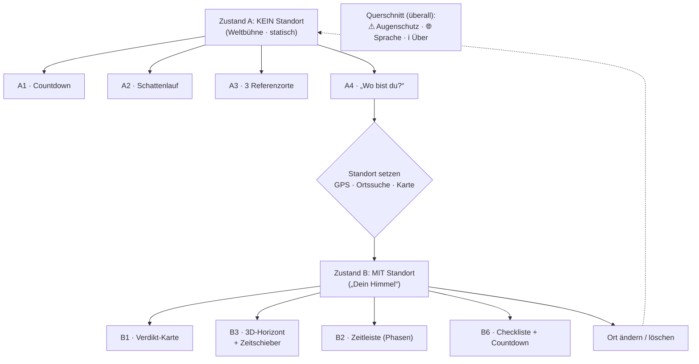

# Screen-Flow & Wireframes

Mobil-first (Portrait). Alle Zahlen sind Platzhalter.

> **Gerenderte Wireframes:** Die visuellen Screen-Wireframes liegen als HTML-Artifact vor
> (im Browser gerendert, sauber statt ASCII):
> <https://claude.ai/code/artifact/7457c9a1-a56a-4eb1-9785-4aac6fc856e1>
> Quelle: [`wireframes.html`](./wireframes.html).
> Dieses Dokument beschreibt den Flow und die Inhalte je Screen; das Artifact zeigt das Layout.

---

## Flow-Übersicht

Zustand A und B sind **derselbe Screen** — B ersetzt nur den „Wo bist du?"-Block durch das
persönliche Briefing. Kein Seitenwechsel, kein zeitabhängiges Umbauen.

---

## Zustand A — ohne Standort („Die Weltbühne")

Ein durchscrollbarer Screen. Reihenfolge und Inhalt der Blöcke:

- **Header (überall):** ☀︎ Eclipse 2026 · 🌐 Sprache · ℹ Über.
- **A1 — Countdown:** großer Live-Countdown „Noch 20 T : 04 : 12 bis zur totalen Finsternis",
  darunter der einordnende Satz „Die erste totale Sonnenfinsternis über Europa seit 1999."
- **A2 — Schattenlauf:** Globus mit dem gesamten Schattenpfad als **gestrichelte Spur**
  (Sibirien → Island → Spanien); der **aktuelle Schatten** läuft live über eine scrubbare
  Zeitleiste (17:30 – 18:30 UTC) darüber, mit Partialitätsringen (90 / 50 / 0 %).
- **A3 — Wie sieht das aus?:** drei Referenzorte nebeneinander mit gleicher Darstellung, aber
  drastisch anderem Erlebnis — Nordspanien (100 %, total) · Berlin (89 %) · Rom (40 %).
- **A4 — Standort-Aufruf:** Überschrift „Was siehst du von dir aus?" (nicht „Standort
  erlauben"), drei gleichwertige Buttons: 📍 Standort verwenden · 🔍 Ort suchen · 🗺 Auf Karte
  tippen.
- **Augenschutz-Fußzeile:** ⚠ „Nie ohne geprüfte Finsternisbrille in die Sonne schauen."

---

## Zustand B — mit Standort („Dein Himmel")

Kopf: **📍 gesetzter Ort** (z. B. „Berlin, Deutschland") mit „ändern". Reihenfolge:
**B1 → B3 → B2 → B6** — „Sehe ich es überhaupt?" (B3) steht bewusst vor „Wann genau?" (B2).

### B1 — Verdikt-Karte
Eine einzige große Aussage, ein Blick: verfinsterte Sonnenscheibe + **„87 % Bedeckung"**,
Satz „Die Sonne geht halb verfinstert unter." Darunter die Kennzahlen — Beginn 19:36 ·
Maximum 20:31 · **Sonnenuntergang 20:47 (⚠ vor Ende der Finsternis)**. Augenschutz-Verdikt:
„Partiell — Brille die **ganze Zeit** auflassen, nie absetzen."

### B2 — Persönliche Zeitleiste (Phasen)
Horizontale Timeline mit den echten lokalen Phasen (1. Kontakt → Maximum → Sonnenuntergang),
jede Phase antippbar mit „wonach schaue ich, wann darf die Brille ab?":
- **19:36 · 1. Kontakt** — der Mond berührt die Sonne.
- **20:31 · Maximum (87 %)** — größte Bedeckung, sichelförmig.
- **20:47 · Sonnenuntergang** — Sonne verschwindet, noch verfinstert.
- In der Totalitätszone zusätzlich: 2./3. Kontakt, Dauer auf die Sekunde, Diamantring ·
  Baily's Beads · Korona · Schattenbänder.

### B3 — 3D-Horizont + Zeitschieber *(Kern-Feature)*
Kopfzeile: „Beim Maximum: Sonne **8° hoch, Richtung 292° WNW** (≈ eine Faust überm Horizont)."
Darunter eine **3D-Ansicht der Umgebung** des Standorts mit **Bergen und Gebäuden**, darüber
die Sonnenbahn und die verfinsterte Sonne. Ein **Zeitschieber** (19:36 – 20:47) fährt durch
den Verlauf; live dazu: ☀ Höhe · ◐ Bedeckung · Uhrzeit. Ob Berge oder Gebäude die tief stehende
Sonne verdecken, sieht man **direkt in der 3D-Szene** — die App macht dazu bewusst keine
berechnete Aussage. Als harte Zeitangabe wird der **Sonnenuntergang** genannt.

### B6 — Checkliste & Countdown
Countdown (gleicher wie A1) plus einfache Checkliste:
- [ ] Finsternisbrille (ISO 12312-2) besorgen + auf Kratzer prüfen
- [ ] **Wettervorhersage checken** *(nur als Punkt — keine Prognose in der App)*
- [ ] Platz mit freier Westsicht suchen
- [ ] Termin in den Kalender eintragen
- [ ] Ggf. Reise in die Totalitätszone planen

Dazu „📅 In Kalender exportieren" mit den korrekten lokalen Phasenzeiten.

---

## Querschnitts-Elemente (überall präsent)

- **🌐 Sprache:** i18n von Anfang an. Umschaltung im Header (Startset DE / EN / ES), Default
  aus Browser-Einstellung; Zeit-/Zahlenformate und Himmelsrichtungen lokalisiert.
- **⚠ Augenschutz:** in A als Fußzeile, in B im Verdikt und in den Phasen.
  - Partial-Standort → „Brille die ganze Zeit auf."
  - Totalitäts-Standort → „nur *innerhalb* der Totalität absetzen."
- **ℹ Über:** Impressum, Datenquellen, Hinweis „Standort bleibt lokal, kein Konto nötig".

---

## Reihenfolge auf einer Seite (Scroll-Ordnung)

**Zustand A:** Header → A1 Countdown → A2 Schattenlauf → A3 drei Orte → A4 Standort-Aufruf →
Augenschutz.

**Zustand B:** Header → 📍 Ort → B1 Verdikt → B3 3D-Horizont → B2 Zeitleiste → B6 Checkliste.
