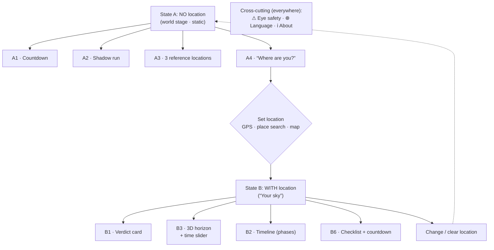

# Screen flow & wireframes

Mobile-first (portrait). All numbers are placeholders.

> **Rendered wireframes:** the visual screen wireframes exist as an HTML artifact (rendered in
> the browser, clean instead of ASCII):
> <https://claude.ai/code/artifact/7457c9a1-a56a-4eb1-9785-4aac6fc856e1>
> Source: [`wireframes.html`](./wireframes.html).
> This document describes the flow and the content per screen; the artifact shows the layout.

---

## Flow overview

States A and B are **the same screen** — B only replaces the "Where are you?" block with the
personal briefing. No page change, no time-dependent rebuilding.

---

## State A — no location ("The world stage")

One scrollable screen. Order and content of the blocks:

- **Header (everywhere):** ☀︎ Eclipse 2026 · 🌐 Language · ℹ About.
- **A1 — Countdown:** a large live countdown "20 d : 04 : 12 to the total eclipse", below it the
  framing sentence "The first total solar eclipse over Europe since 1999."
- **A2 — Shadow run:** globe with the entire shadow path as a **dashed trace** (Siberia →
  Iceland → Spain); the **current shadow** moves live over a scrubbable timeline (17:30 – 18:30
  UTC) on top, with partiality rings (90 / 50 / 0%).
- **A3 — What does it look like?:** three reference locations side by side with the same
  rendering but a drastically different experience — northern Spain (100%, total) · Berlin
  (89%) · Rome (40%).
- **A4 — Location call:** heading "What do you see from where you are?" (not "Allow location"),
  three equal buttons: 📍 Use location · 🔍 Search place · 🗺 Tap on map.
- **Eye-safety footer:** ⚠ "Never look at the Sun without tested eclipse glasses."

---

## State B — with location ("Your sky")

Head: **📍 the set location** (e.g. "Berlin, Germany") with "change". Order:
**B1 → B3 → B2 → B6** — "Can I even see it?" (B3) deliberately comes before "When exactly?" (B2).

### B1 — Verdict card

A single big statement, one glance: eclipsed solar disc + **"87% obscuration"**, the sentence
"The Sun sets half eclipsed." Below it the key figures — begins 19:36 · maximum 20:31 ·
**sunset 20:47 (⚠ before the eclipse ends)**. Eye-safety verdict: "Partial — keep the glasses
on **the whole time**, never take them off."

### B2 — Personal timeline (phases)

A horizontal timeline with the real local phases (1st contact → maximum → sunset), each phase
tappable with "what do I look for, when may the glasses come off?":

- **19:36 · 1st contact** — the Moon touches the Sun.
- **20:31 · maximum (87%)** — greatest obscuration, crescent-shaped.
- **20:47 · sunset** — the Sun disappears, still eclipsed.
- In the zone of totality additionally: 2nd/3rd contact, duration to the second, diamond ring ·
  Baily's beads · corona · shadow bands.

### B3 — 3D horizon + time slider _(core feature)_

Header line: "At maximum: Sun **8° high, towards 292° WNW** (≈ a fist above the horizon)."
Below it a **3D view of the surroundings** of the location with **mountains and buildings**, over
it the Sun's path and the eclipsed Sun. A **time slider** (19:36 – 20:47) runs through the
sequence; live alongside: ☀ altitude · ◐ obscuration · time. Whether mountains or buildings hide
the low-lying Sun is seen **directly in the 3D scene** — the app deliberately makes no computed
claim about it. As a hard time, **sunset** is given.

### B6 — Checklist & countdown

Countdown (same as A1) plus a simple checklist:

- [ ] Get eclipse glasses (ISO 12312-2) + check them for scratches
- [ ] **Check the weather forecast** _(only as an item — no forecast in the app)_
- [ ] Find a spot with a clear western view
- [ ] Add the date to your calendar
- [ ] If applicable, plan travel into the zone of totality

Plus "📅 Export to calendar" with the correct local phase times.

---

## Cross-cutting elements (present everywhere)

- **🌐 Language:** i18n from the start. Switching in the header (initial set DE / EN / ES),
  default from the browser setting; time/number formats and compass directions localised.
- **⚠ Eye safety:** in A as a footer, in B in the verdict and in the phases.
   - Partial location → "Keep the glasses on the whole time."
   - Totality location → "Only take them off _during_ totality."
- **ℹ About:** legal notice, data sources, note "the location stays local, no account needed".

---

## Order on a single page (scroll order)

**State A:** Header → A1 countdown → A2 shadow run → A3 three locations → A4 location call →
eye safety.

**State B:** Header → 📍 location → B1 verdict → B3 3D horizon → B2 timeline → B6 checklist.
