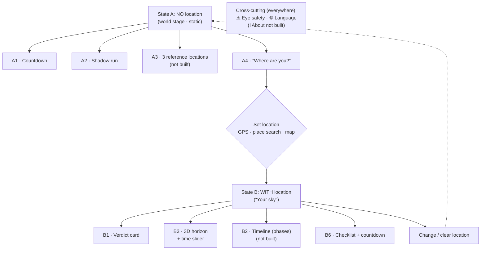

# Screen flow & wireframes

Mobile-first (portrait). All numbers are placeholders.

> **This is the design intent, not a description of the build.** Three blocks below were never built —
> **A3** (three reference locations), **B2** (phase timeline) and the header's **ℹ About**. B2 in particular
> was _decided against_ rather than deferred: the phase information lives in B3's scrubber ticks and
> totality band (TESTING.md §7). Each is marked inline. Going the other way, `TimeZoneNote` ships between
> A2 and the B block and appears in no wireframe.
>
> **Rendered wireframes:** [`wireframes.html`](./wireframes.html) in this directory is the source of truth.
> It was also published as an artifact
> (<https://claude.ai/code/artifact/7457c9a1-a56a-4eb1-9785-4aac6fc856e1>), which may not be reachable
> outside the account that created it.
> This document describes the flow and the content per screen; the HTML shows the layout.

---

## Flow overview

States A and B are **the same screen** — B only replaces the "Where are you?" block with the
personal briefing. No page change, no time-dependent rebuilding.

---

## State A — no location ("The world stage")

One scrollable screen. Order and content of the blocks:

- **Header (everywhere):** ☀︎ Eclipse 2026 · 🌐 Language. _(ℹ About is not built; the `nav.about`
  string exists in all three catalogues but nothing renders it.)_
- **A1 — Countdown:** a large live countdown "20 d : 04 : 12 to the total eclipse", below it the
  framing sentence "The first total solar eclipse over mainland Europe since 1999."
- **A2 — Shadow run:** globe with the entire shadow path as a **dashed trace** (Siberia →
  Iceland → Spain); the **current shadow** moves live over a scrubbable timeline (17:30 – 18:30
  UTC) on top, with partiality rings (90 / 50 / 0%).
- **A3 — What does it look like?** _(not built)_ — three reference locations side by side with the same
  rendering but a drastically different experience — northern Spain (100%, total) · Berlin
  (89%) · Rome (40%).
- **A4 — Location call:** heading "What do you see from where you are?" (not "Allow location"),
  three equal buttons: 📍 Use location · 🔍 Search place · 🗺 Tap on map.
- **Eye safety:** no global banner — the warning lives in context, where it is read: the checklist's
  glasses item (with the injury reason) and the calendar entry. The verdict card carried an accent line
  of its own until it was dropped as one repetition too many; `b6-checklist.spec.ts` now holds the claim.

---

## State B — with location ("Your sky")

Head: **📍 the set location** (e.g. "Berlin, Germany") with "change". Planned order:
**B1 → B3 → B2 → B6** — "Can I even see it?" (B3) deliberately comes before "When exactly?" (B2).
_Built order is **B1 → B3 → B6**_, with a `SectionDivider` opening the block; B2 was folded into B3.

### B1 — Verdict card

A single big statement, one glance: eclipsed solar disc + **"87% obscuration"**, the sentence
"The Sun sets half eclipsed." Below it the key figures — begins 19:36 · maximum 20:31 ·
**sunset 20:47 (⚠ before the eclipse ends)**. Eye-safety verdict: "Partial — keep the glasses
on **the whole time**, never take them off."

### B2 — Personal timeline (phases) _(not built — folded into B3)_

A horizontal timeline with the real local phases (1st contact → maximum → sunset), each phase
tappable with "what do I look for, when may the glasses come off?":

- **19:36 · 1st contact** — the Moon touches the Sun.
- **20:31 · maximum (87%)** — greatest obscuration, crescent-shaped.
- **20:47 · sunset** — the Sun disappears, still eclipsed.
- In the zone of totality additionally: 2nd/3rd contact, duration to the second, diamond ring ·
  Baily's beads · corona · shadow bands.

### B3 — 3D horizon + time slider _(core feature)_

Header line: "At maximum: Sun **8° high, towards 292° WNW** (≈ a fist above the horizon)."
Below it a **3D view of the surroundings** of the location with **mountains and buildings**, over
it the Sun's path and the eclipsed Sun at its real size. A **time slider** (19:36 – 20:47) runs
through the sequence; live alongside: ☀ altitude · ◐ obscuration · time. The surroundings give the
lay of the land; the Sun is drawn on top and stays visible until it sets (terrain occlusion is
intentionally not modelled — the observer's height is unknown). As a hard time, **sunset** is
given.

### B6 — Checklist & countdown

Reduced to the tick-off list alone (no countdown, no calendar export — both local promises) wherever
there is no local maximum, which since the time-zone guess landed means the prerendered HTML only.
Hidden entirely where the chosen location sees nothing of the eclipse.

Countdown (same as A1) plus a simple checklist:

- [ ] Get eclipse glasses (ISO 12312-2) + check them for scratches
- [ ] **Check the weather forecast** _(only as an item — no forecast in the app)_
- [ ] Find a spot with a clear western view
- [ ] Add the date to your calendar
- [ ] If applicable, plan travel into the zone of totality

Plus "📅 Export to calendar" with the correct local phase times.

---

## Cross-cutting elements (present everywhere)

- **🌐 Language:** i18n from the start. Switching in the header (initial set DE / EN / ES),
  default from the browser setting; time/number formats and compass directions localised.
- **⚠ Eye safety:** in A as a footer, in B in the verdict and in the phases.
   - Partial location → "Keep the glasses on the whole time."
   - Totality location → "Only take them off _during_ totality."
- **ℹ About** _(not built)_**:** legal notice, data sources, note "the location stays local, no account
  needed".

---

## Order on a single page (scroll order)

**State A (planned):** Header → A1 countdown → A2 shadow run → A3 three locations → A4 location call.
**State A (built):** Header → A1 countdown → A2 shadow run (time-zone note as its footer) → A4 location
call → donate → colophon. **A reader never sees this**: on the client the location store falls back to a
place guessed from the time zone, so state A survives only in the prerendered HTML — which is exactly who
still needs it, crawlers and readers without JavaScript.

**State B (planned):** Header → 📍 location → B1 verdict → B3 3D horizon → B2 timeline → B6 checklist.
**State B (built):** Header → **B0 heading** (the place, the change button, and — for a guessed or
showcase place — where it came from) → B1 verdict → B3 3D horizon → divider → A1 countdown → A2 shadow
run (TimeZoneNote as its footer) → divider → B6 checklist.

**The B block leads, and that is a deliberate reversal of the plan above.** The A blocks were meant to
open the page and hand over to B. In practice they buried it: on a 390×844 phone B3 began around 2000px
down, past a full-height globe and behind a button and a dialog, and the traffic said almost nobody got
there. B3 now begins at ~500px — inside the first screen. B0 and B1 still lead it rather than the canvas
itself, because both are instant text: the first paint reads "Sonnenfinsternis-Simulation für Berlin ·
85 % der Sonne bedeckt" while the WebGL scene builds just below, instead of opening on "Gelände wird
geladen …". The countdown and globe keep their content and become the second movement — context for the
reader's own sky rather than the way in to it.

B0 also took the place of the "your sky" divider that used to open this half: a divider only names a
section, and what a reader has to notice is that the sky below is theirs to set.

## Segment grammar

Every section on the page is at most four slots, in this order (shared classes in `base.css`):

1. **Header** — `.block-head`: one `h2`, optionally one right-aligned meta (the `.place` name + change
   button on B1). Nothing else at heading weight. Dates and times belong with the time UI they describe
   (A2's date sits in its slider readout), not in headers.
2. **Intro** — `.sub`: optional, **one line**, muted. If it needs a second sentence, the graphic is not
   carrying its weight — fix the graphic, not the text.
3. **Content** — the stage / list / graphic. All controls (time sliders, readouts, buttons) live inside
   this slot, styled as part of the content.
4. **Footer** — `.seg-foot`: optional, one caption line for context that must not interrupt reading
   (e.g. A2's time-zone note).

Nothing floats between sections — the page is sections and `SectionDivider`s only, enforced by
`tests/segments.spec.ts`. Card borders are reserved for **actions** (the location CTA, the donate box);
content sections separate by whitespace alone.

**Sanctioned exceptions:** the countdown is the page's hero and carries no header — a "Countdown"
heading over giant digits would be noise. The donate card is likewise headerless: it is a personal note,
not a titled section. Both are named in `tests/segments.spec.ts`; a new headerless section or a new
border fails there until it is sanctioned here. (The verdict's eye-safety line was a third exception —
the one border allowed on a content section. It is gone, so the border rule is exceptionless again.)
